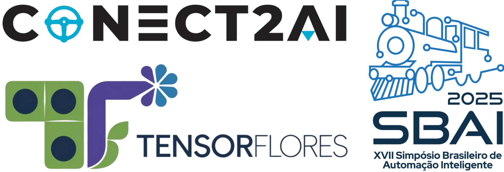

<!-- Event Logo -->

<p align="center">
  
</p>

# 🧠 SBAI 2025 Minicourse: Advanced TinyMLOPs Methods: Implementing Machine Learning in Embedded Systems

### ✍🏾Authors: [Thommas Flores](https://github.com/thommaskevin), [Daniel Costa](https://github.com/daniel-gcosta) and [Ivanovitch Silva](https://github.com/ivanovitchm)

📅 **Date:** July 28, 2025

📍 **Event:** Brazilian Symposium on Intelligent Automation (SBAI 2025)

## 📌 Overview

This minicourse addresses the growing demand for machine learning deployment on low-power embedded devices, driven by the evolution of edge computing. It focuses on advanced quantization strategies—including **Quantization-Aware Training (QAT)** and **Post-Training Quantization (PTQ)**—as well as model compression techniques using the **TensorFlores** framework.

Developed by the **Conecta2AI research group (UFRN)** in collaboration with **LES2 (FEUP)**, TensorFlores automates MLP optimization and C++ code generation for microcontrollers, enabling efficient and portable AI at the edge.

## 🎯 Goals

### General Goal

Enable participants to design and deploy optimized machine learning models on embedded systems using TensorFlores.

### Specific Objectives

- Understand the mathematical foundations of model quantization.
- Apply advanced model compression techniques (PTQ and QAT) for efficient ML on resource-constrained devices.
- Gain hands-on experience in developing and deploying optimized TinyML models.

## 🧑‍💻 Target Audience & Prerequisites

### Target Audience

Students, educators, researchers, and practitioners in Engineering, Computer Science, or related fields interested in embedded ML.

### Prerequisites

Basic knowledge of **Python** and **C++ (Arduino IDE)** is required.


## 🗂️ Course Outline

### ⏱️ Duration: 3 hours

### Theoretical Part (1 hour)

1. **Introduction to TinyML** (20 min)

   - What is TinyML and why it matters
   - Use cases and industry applications
   - Challenges and opportunities
2. **Post-Training Quantization (PTQ)** (20 min)

   - Overview and best practices
   - Example applications in TinyML
3. **Quantization-Aware Training (QAT)** (20 min)

   - Overview and best practices
   - Practical use cases

### Practical Part (2 hours)

1. **Setting Up TensorFlores** (50 min)

   - Installation and environment setup
   - Workflow: training, quantization, C++ code generation
   - Integration with microcontrollers
2. **Training and Deploying MLP Models** (50 min)

   - Guide for PTQ-based deployment
   - Guide for QAT-based deployment
3. **Challenges in Real-World Projects** (20 min)

   - Discussion of deployment challenges
   - Shared experiences and practical tips

---

## 🔧 Required Materials

- Participant laptops with **Python IDE** and **Arduino IDE** installed
- Internet access
- Projector or screen for visual presentations

---

## 📤 Installation

- Install **Python v3.9.6**
- Clone this repository.
- Inside the cloned repository folder, open the terminal or command prompt and run:

```bash
python -m venv venv
```

- Activate the virtual environment:

```bash
venv\Scripts\activate
```

- Install the required packages inside the environment:

```bash
pip install -r requirements.txt
```

## 📁 Repository Structure

```plaintext
📦 SBAI2025-TensorFlores
├── 📂 code
│   ├── 📂 arduino
│   │   ├── model.h
│   │   └── tensorflores.ino
│   └── 📂 notebooks
│       ├── 01_EDA.ipynb
│       ├── 02_data_segregation.ipynb
│       ├── 03_train_standard.ipynb
│       ├── 04_post_train_quantization.ipynb
│       ├── 05_train_aware_quantization.ipynb
│       └── my_key.py
├── 📂 data
│   └── emission_total.csv
├── 📂 docs
│   └── Ementa.pdf
├── 📂 figures
│   └── minicurso.png
├──📜 .gitignore
├──📜 LICENSE.txt
├──📜 README.MD
└──📜 requirements.txt     
```

## 📚 Jupyter Notebooks

- [](https://github.com/conect2ai/SBAI2025-TensorFlores/blob/main/code/notebooks/01_EDA.ipynb) Exploratory Data Analysis (EDA)

- [](https://github.com/conect2ai/SBAI2025-TensorFlores/blob/main/code/notebooks/02_data_segregation.ipynb) Data Segregation

- [](https://github.com/conect2ai/SBAI2025-TensorFlores/blob/main/code/notebooks/03_train_standard.ipynb) Training Standard Model
- [](https://github.com/conect2ai/SBAI2025-TensorFlores/blob/main/code/notebooks/04_post_train_quantization.ipynb) Post Training Quantization
- [](https://github.com/conect2ai/SBAI2025-TensorFlores/blob/main/code/notebooks/05_train_aware_quantization.ipynb) Quantization Aware Training

## 📚 Arduino Codes

- [](https://github.com/conect2ai/SBAI2025-TensorFlores/blob/main/code/arduino/tensorflores.ino) Arduino ML code

## 🗂️ References

1. **Flores, T.K.S., Costa, D.G., & Silva, I.** (2025). [*TensorFlores: An enhanced Python-based TinyML framework*](https://doi.org/10.1016/j.softx.2025.102224). *SoftwareX*, 31, 102224.→ Presents the TensorFlores framework, its modular architecture, evolving clustering-based quantization, and automatic C++ code generation for embedded systems.
2. **Flores, T.K.S., Medeiros, M., Silva, M., Costa, D.G., & Silva, I.** (2025). [*Enhanced Vector Quantization for Embedded Machine Learning: A Post-Training Approach With Incremental Clustering*](https://ieeexplore.ieee.org/document/10849357). *IEEE Access*, 13, 17440–17456.→ Explores scalable post-training quantization for automotive ML systems using incremental clustering techniques.
3. **Flores, T.K.S., & Silva, I.** (2024). [*Lightweight Post-Training Quantization Method for TinyML Model Compression*](https://ieeexplore.ieee.org/document/10401949). *IEEE EUROCON Conference*.
   → Describes a lightweight post-training quantization method optimized for low-power, resource-constrained embedded platforms.

## License

This package is licensed under the [MIT License](https://github.com/conect2ai/Conect2Py-Package/blob/main/LICENSE) - © 2023 Conect2ai.
